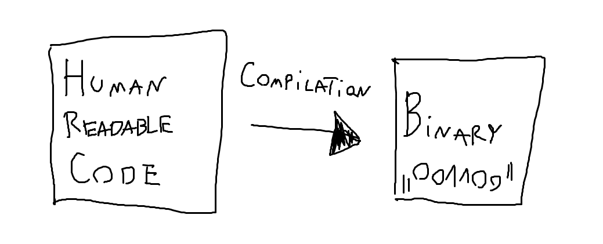

# 00 -> Introduction to Reverse Engineering Games

Hello there!<br>
Welcome to the REG! This episode will focus on some
basic prerequisites, the format of the series, as well as explain
exactly what "Reverse Engineering" is!

## Prerequisites

As far as prerequisites go for now there are none!<br>
Be ready though cause future episodes may require you to
install stuff on your PC/read up on some articles on your own!

## Format of the series

Episodes will be released in Text and Video formats.
At the top of the episode there should be a link to its Video version
(if it has one)

Every episode will focus on a **certain** topic and after explaining it
will also contain a small exercise to test yourself!<br>
The exercise will always be located in the `exercise.md` file of the folder.<br>
You can check if your answer is correct by looking at the `solution.md` file which
contains the solution, as well as `base64` encrypted writeup on how its achieved
(encryption is there to not accidentally spoil the solution to yourself)<br>
Don't worry about exercises being too hard, since you can always ask for help in
our [Discord](https://discord.jojomodding.com)

## "ok cool, wtf is reverse engineering anyways?"

Good question. To answer it we will need to find out how the *programs* on your
computer actually work. <br>



This lil drawing i made in MS Paint shows how ***"compilation"*** works. <br>
***Compilation*** is a **one-way** operation which translates your
human-readable code into a bunch of 1's and 0's for your PC to run.<br>
For example, let's take this C++ code (don't worry you don't need to understand it)

```cpp
#include <iostream> // Includes the standard "input/output" functions

// Start of the program
int main() { 
    std::cout << "Hello World!\n"; // Print "Hello World!" to the output
    return 0; // return code 0 (success)
}
```

As you can see it's pretty readable and understandable. Now let's look at what
this actually *compiles* to.

```hex
55
48 89 e5
48 83 ec 10
c7 45 fc 00 00 00 00
48 8b 3d 00 00 00 00
48 8b 35 00 00 00 00
e8 00 00 00 00
31 c0
48 83 c4 10
5d
c3
```

Now you might say:<br>
"Woah woah woah, hold your horses though, didn't you say that ***compilation*** transforms
code into 0's and 1's? I see other numbers **and** letters here you fucking liar."<br>
And yes you are right, compilation does compile into 0's and 1's as mentioned earlier
***however***, representing this in binary would take up a **lot** of your screen.
This here is a *representation* of the generated binary in ***hex***.<br>
Hex (the hexadecimal numerical system) allows us to compress every "chunk" of
eight 0's and 1's into just 2 symbols. (Those systems will be discussed in a future
chapter)

Anyways as you can see, this looks like some unreadable garbage which doesnt
make any sense really. But to your computer, this string of 0's and 1's actually
does make sense and it will happily execute it.

And that's the point of programming languages, which allow
developers to talk to the computer *abstracting* away the complexity of actually
writing 0's and 1's to do things.

"get to your point bro"<br>
Chill bruh, im getting there. Anyways, what's really important is that you
can't simply reverse the ***compilation*** step and "***decompile***" the binary
into human-readable code. Whilst the actual steps of the program in the binary
and in the code are **exactly** the same, the code structure, comments,
variable/function names are lost in the ***compilation*** step since they are
simply not required for the program to run.

You can think of it like with baking cakes. You can't simply "***unbake***" a cake
can you?<br>
What you can do instead though, is *observe the cake, taste it and based on
trial and error* ***deduce
how it could be made.***

This is basically how ***reverse engineering*** works. You look at the behavior
of the program, analyze it, and than you can ***deduce*** how it works and use
it to your advantage.

## Quick Recap

- Computers use 0's and 1's to run your programs.
- Humans don't actually write 0's and 1's to create those programs,
instead they use ***programming languages*** which translate human-readable code
into the machine gibberish
- You can't unbake a cake, as well as a program.
- Reverse Engineering is a process of analyzing the "cake" that is our program
and finding out how it's made to take advantage of it.

## Exercise

Good luck on your first exercise!<br>
[Have fun >:)](exercise.md)

### made by kap
