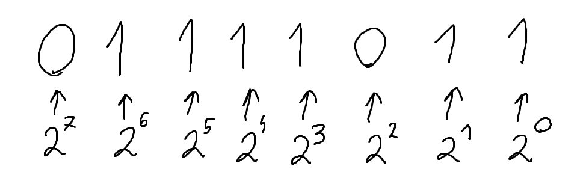
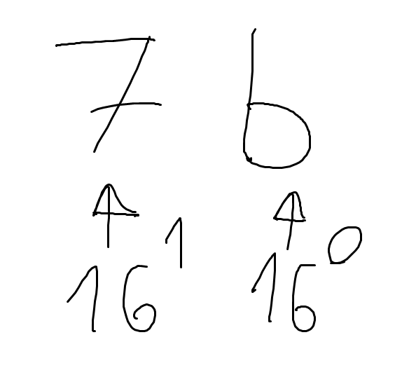

# 01 -> Numerical Systems

Welcome to the second episode >:D<br>
Glad you made it here!

## "numerical systems? tf do i need this for"

Oh poor little soul. Trust me you do **need** this.
Don't be afraid though, this stuff is pretty easy fortunately
enough hahaha. Througout the series we will use mainly 3 numerical systems:

- Arabic (base10) -> 0, 1, 2, 3, 4, 5, 6, 7, 8, 9
- Binary (base2) -> 0, 1
- Hexadecimal (base16) -> 0-9 + A, B, C, D, E, F

***Arabic*** is pretty self explanatory i think (it's just what you use every day)<br>
***Binary*** is used obviously because computers operate on it<br>
and ***Hex*** is used for *simplifying* the ***binary*** values into 2 characters

## Binary

***Binary*** is pretty simple. It only uses 2 symbols for representing values.<br>
Either a 1 or a 0. Here's an example of representing number `123` in binary.

```c
0b01111011
```

"ok, but how does it work though?"<br>
Great question. Let's try to translate this string of 0's and 1's back into `123`<br>
First notice that there's a prefix of `0b` in our binary string.
This will be our indicator throughout the series that what we are looking at
is indeed a binary value. So let's first yeet that out.

```c
01111011
```

Alright now the first step is to imagine each digit in our number as a 2
raised to the (n-1)th power (2<sup>n-1</sup>).<br>
I know, I know this sounds ultra duper fancy and complicated but it's just this:



So basically we just assign a power of two to every single digit going right to left,
and then we can actually calculate the value simply by adding powers if the ***bit***
(digit in binary) is on (is 1) or off (is 0).

Let's do some calculating than!<br>
We can see here that ***bit*** 1 (going from right to left) is on. So we will add
2<sup>0</sup> to our number.<br>
x = 2<sup>0</sup> + ...

Next ***bit***, we have flipped on too! Let's add 2<sup>1</sup> to our x!<br>
x = 2<sup>0</sup> + 2<sup>1</sup> + ...

After that we have a `0` bit, so we skip 2<sup>2</sup>.

Next we have an on bit, so let's add 2<sup>3</sup>.<br>
x = 2<sup>0</sup> + 2<sup>1</sup> + 2<sup>3</sup> + ...

And so on until we arrive at this:

x = 2<sup>0</sup> + 2<sup>1</sup> + 2<sup>3</sup> + 2<sup>4</sup> +
2<sup>5</sup> + 2<sup>6</sup> = 1 + 2 + 8 + 16 + 32 + 64 = 123

Pretty easy right?

## Hexadecimal

Ah yes ***hex***. My favorite.<br>
It works on a similar basis to binary, but instead of having on/off values, we just
multiply 16<sup>n-1</sup> * x, where x is the value of the digit.
Now heres `123` in hex.

```c
0x7B
```

First notice how theres a `0x` prefix before the actual data of the value. This will
be used as an indicator throught the series that we are dealing with a hexadecimal
value.



Now we need to simply multiply those powers and add them up!

11 * 16<sup>0</sup> + 7 * 16<sup>1</sup> = 123

Notice how `b` changed into `11` since we went over digits and started counting in
characters (0, 1, 2, 3, 4, 5, 6, 7, 8, 9, A, B)

Now this may seem kinda complicated, cause it is, but the point of hexadecimal
isn't to actually know the "*true*" value of a ***byte*** (array of 8 bits)
but to make it easy to *compare* ***bytes*** to each other.<br>

You can clearly see that `0x123 < 0x213` <br>
But not so much with `0b01111011 < 0b1000010011`

## Quick Recap

- We use 3 numerical systems around here: Arabic (base10), Binary (base2)
and Hex (base16)
- You gotta understand those systems, but not be able to calculate the
numbers instantly nor fast even
- a ***bit*** is a 0 or a 1
- a ***byte*** is an array of 8 ***bits***

## Exercise

[Have fun >:)](exercise.md)

### made by kap
